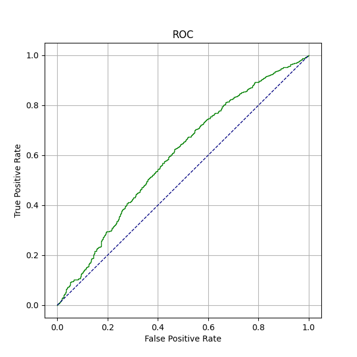

this is what I have but I hope to update it by 23 December

https://gitlab.cs.nuim.ie/u210251/cs401-hw2-great-fun

# Report - Bone Data

## I use Python

## Library

* numpy
* pandas
* sklearn
* matplotlib
* joblib
* random
* sysimport
* time
* sys 

## What I did

### Code By Python

### Try Three different Kernel

1. Sigmoid
2. Gaussian
3. Polynomial

### Try to get better results by modifying some parameters

1. C
2. gama
3. coef0

### Get Confusion Matrix

One of the Matrix: (From Test_Set which is 20%*Train_Set)

$$
\begin{bmatrix} 12986 & 14791 \\\\ 13889 & 17334 \end{bmatrix}
$$

### Draw ROC

> I take ten point as follows:

1. (FPR=5.55014606e-02, TPR=0.03597122)

2. (FPR=0.11613566, TPR=1.51898734e-01)

3. (FPR=0.17574512, TPR=2.56085686e-01)

4. (FPR=0.24665982, TPR=3.54430380e-01)

5. (FPR=0.32168551, TPR=4.50827653e-01)

6. (FPR=0.40904419, TPR=5.51119766e-01)

7. (FPR=0.50154162, TPR=6.51411879e-01)

8. (FPR=0.60842754, TPR=7.54625122e-01)

9. (FPR=0.72970195, TPR=8.50048685e-01)

10. (FPR=0.89825283, TPR=9.51314508e-01)

### Other Classifier

> Polynomial is the best choice

1. Gaussian. 

I had try C=0.01 to C=1.0

2. Sigmoid

I had try C=0.01 to C=1.0

### More want to do

* improvement of accuracy.
* I‘m trying to do it.:w
